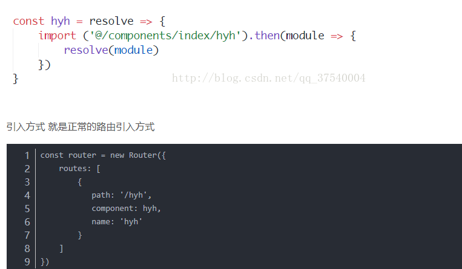

# vue学习
## 1.vue懒加载[参考教程](https://blog.csdn.net/qq_37540004/article/details/78727063)
 1.方式1


 2.方式2 [当前项目的使用方式]
```
...

const Index=(resolve) => require(['../components/index/index'], resolve) // 这里是你的模块 不用import去引入了

const router = new Router({
    routes: [
		 {
		       path: '/index',
		       component: Index
		   }
	]
})
...
```
3.方式3
```
// r就是resolve
const list = r => require.ensure([], () => r(require('../components/list/list')), 'list');
// 路由也是正常的写法  这种是官方推荐的写的 按模块划分懒加载 
const router = new Router({
    routes: [
		{
		   path: '/list/blog',
		   component: list,
		   name: 'blog'
		}
	]
})
```
## 2.关于vue methods
在vue 方法中，若有a,b 两个data里面的变量，当其中任意一个发生变化时都会重新执行当前方法！！！！！！！
